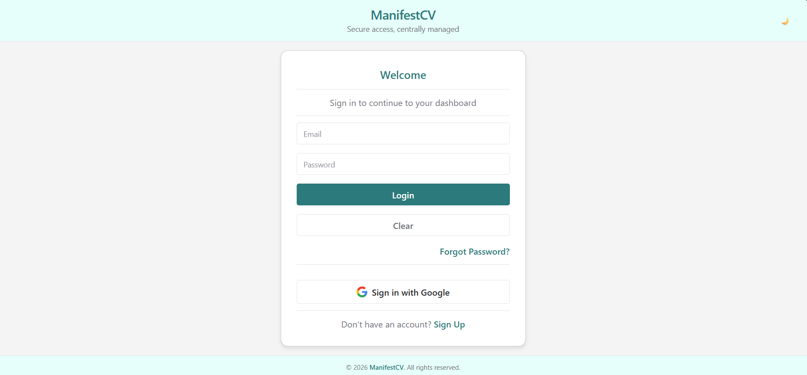
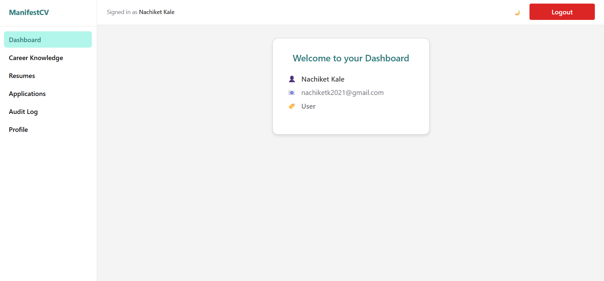
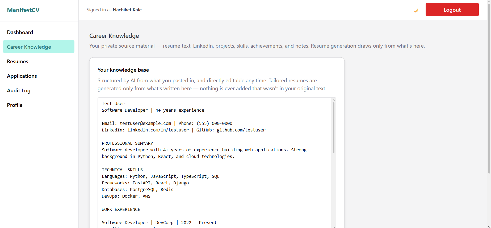
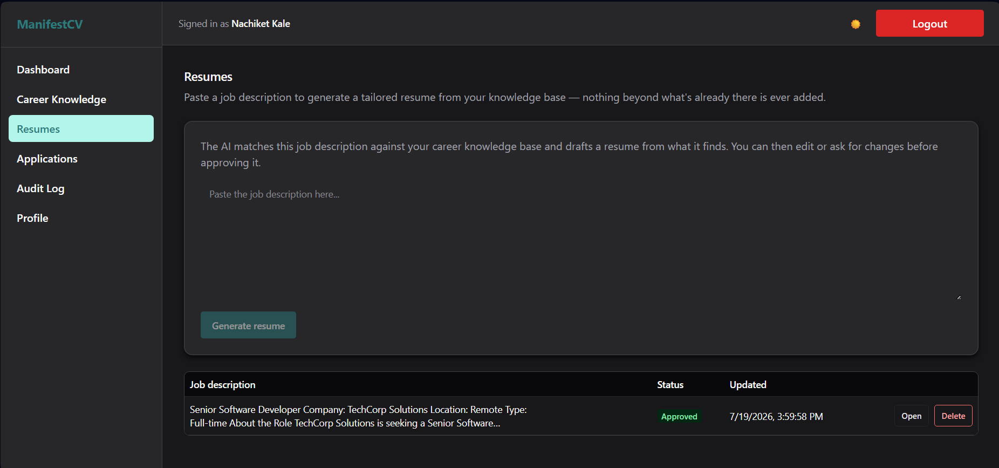
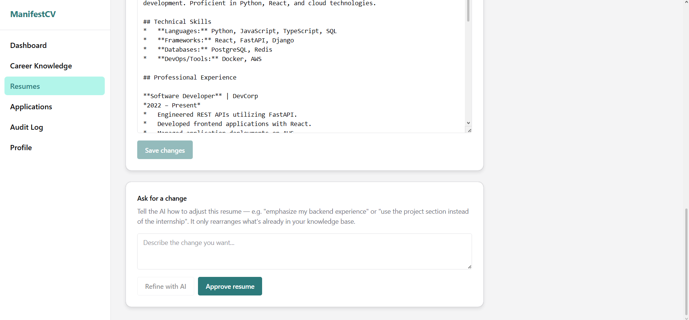
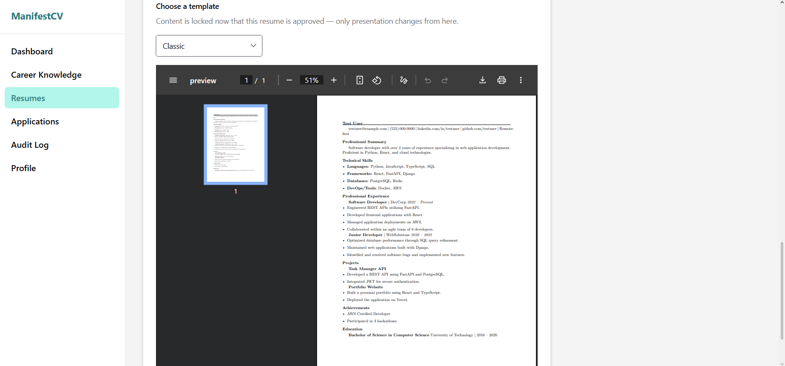
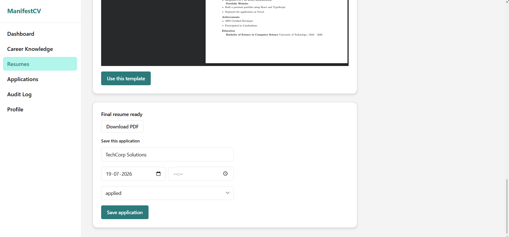
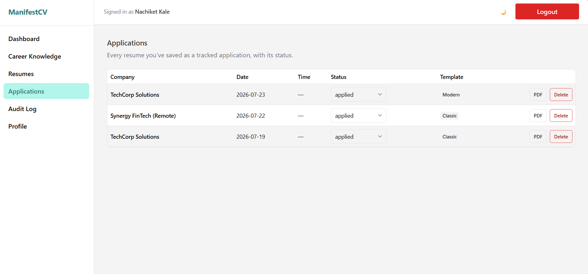

# ManifestCV


---

## Overview

ManifestCV turns one private career knowledge base into as many tailored, AI-assisted resumes as you need — one per job description — compiled to a polished PDF and tracked through to application. Paste in everything you know about your own career once; ManifestCV structures it, semantically retrieves the relevant parts for each job you apply to, generates and refines a resume from them, and lets you compile and track the result.

Identity, sessions, and access control are provided by [mystic-auth](https://github.com/Nachiket-2024/mystic-auth), a full-stack auth/PBAC template, vendored in unmodified — see [Auth & Authorization](docs/auth/overview.md) for how ManifestCV is wired to it, and the [mystic-auth repository](https://github.com/Nachiket-2024/mystic-auth) itself for everything about how login, OAuth2, and policy-based access control actually work.

See [`docs/README.md`](docs/README.md) for the full documentation set — architecture, product features, database, API reference, testing, Docker, CI/CD, and deployment.

---

## Screenshots

### Login Page


---

### Dashboard


---

### Career Knowledge


---

### Resumes (Dark Mode)


---

### Resume Refinement


---

### Template Preview


---

### Save Application


---

### Applications


---

## ✨ Features

- **Career Knowledge Base** — paste in your resume, LinkedIn export, project notes, whatever you have; Gemini structures it into clean, editable Markdown, always directly re-editable by hand afterward. See [Career Knowledge](docs/career-knowledge/overview.md).
- **Semantic Retrieval** — your knowledge base is chunked and embedded into Qdrant, so resume generation retrieves only the sections relevant to a specific job description instead of dumping everything into one prompt. See [AI & Retrieval](docs/ai-and-retrieval/overview.md).
- **AI-Assisted Resume Drafting** — generate an initial tailored resume from a job description, then refine it with natural-language instructions that re-match the knowledge base rather than just rephrasing the existing text. See [Resumes](docs/resumes/overview.md).
- **PDF Document Generation** — once approved, compile a resume to a polished PDF via a Markdown→LaTeX pipeline and a self-contained `tectonic` engine — no LaTeX installation required, and multiple visual templates to choose from. See [Document Generation](docs/document-generation/overview.md).
- **Application Tracking** — save a finalized resume against a job application; the resume content, template, and PDF are snapshotted at that moment, so tracked applications survive later edits to the source draft. See [Applications](docs/applications/overview.md).
- **Real authentication, not a demo login** — email+password with Argon2 hashing, Google OAuth2/PKCE, JWT access+refresh tokens as httpOnly cookies, refresh-token rotation with reuse detection, rate limiting, and audit logging — all inherited from mystic-auth. See [Auth & Authorization](docs/auth/overview.md).
- **Error monitoring, opt-in** — backend and frontend exceptions reportable to self-hosted Bugsink (or Sentry's hosted free tier) via the Sentry SDK protocol; zero SDK calls and zero added frontend bytes until you turn it on. See [Error Monitoring](docs/error-monitoring/overview.md).

---

## 🛠️ Stack

- **Backend:** FastAPI (fully async), SQLAlchemy 2.0 (async, `asyncpg`), Alembic migrations
- **AI:** Google Gemini — text generation (structuring, resume generation/refinement) and embeddings
- **Retrieval:** Qdrant — self-hosted vector search over per-user career knowledge chunks
- **Document generation:** Markdown → LaTeX → `tectonic` (self-contained LaTeX engine, no TeX Live install)
- **Authentication:** Email + Password (Argon2 hashing, JWT access & refresh tokens), Google OAuth2 with PKCE — via mystic-auth
- **Frontend:** TypeScript, React 19 + Vite, Chakra UI v3
- **State Management:** Zustand (client/session state) + TanStack Query (server state/caching)
- **Database:** PostgreSQL (async)
- **Caching & Tasks:** Redis + Taskiq (async background email delivery)
- **Error monitoring:** Sentry SDK protocol, self-hosted Bugsink by default (or Sentry's hosted free tier) — optional, opt-in, disabled unless explicitly configured
- **Deployment:** Docker (dev and production Compose files)

---

## 📥 Installation

### 1. Clone the repository

```bash
git clone <this-repository-url>
cd manifest-cv
```

### 2. Set up the environment (only if running locally; skip if using Docker)

> Instructions below assume that you are at the root of the repository while running the commands.

Install backend dependencies:

```bash
cd backend
pip install -r requirements.txt
```

Install frontend dependencies:

```bash
cd frontend
npm install
```

---

## ⚙️ Environment Variables

All environment variables are defined in `.env.example` in both the project root and the `frontend` folder. Copy each to `.env` and fill in your own values:

```bash
cp .env.example .env
cp frontend/.env.example frontend/.env
```

`SECRET_KEY` must be at least 32 characters — the app refuses to start with a shorter value. `GEMINI_API_KEY` is also required — without it the backend won't start at all; get a free-tier key at [aistudio.google.com/apikey](https://aistudio.google.com/apikey). `QDRANT_URL` defaults to the Docker-networked `qdrant` service and needs no separate signup.

---

## 🚀 Run the App

> Instructions below assume that you are at the root of the repository while running the commands.

> To enable Google login, configure your Google Cloud project and OAuth API first (see [mystic-auth's OAuth2/PKCE docs](https://github.com/Nachiket-2024/mystic-auth/blob/main/docs/authentication/oauth2-pkce.md) for the exact `GOOGLE_REDIRECT_URI` requirement). The app runs without it — only Google login specifically won't work until it's configured.

### Path 1. Docker (Recommended)

```bash
docker compose up
```

Once the services are running:

- **Backend:** [http://localhost:8000/docs](http://localhost:8000/docs) – FastAPI API docs and endpoints
- **Frontend:** [http://localhost:5173](http://localhost:5173) – React + Vite frontend
- **PostgreSQL:** `localhost:5433` – Database ready for connections (non-default host port; containers reach it at `postgres:5432` internally)
- **Redis:** `localhost:6380` – Cache, rate limiting, and Taskiq broker (non-default host port; containers reach it at `redis:6379` internally)
- **Qdrant:** `localhost:6333` – Vector store for career knowledge retrieval
- **Taskiq worker:** Automatically listens for async tasks (email sending)
- **Alembic migrations:** Run automatically on stack startup via the dedicated `alembic` service (`alembic upgrade head`) — applies mystic-auth's inherited schema and ManifestCV's own tables in one pass

> **`docker compose up` never starts error monitoring (Bugsink).** It's a separate, opt-in Docker Compose profile — disabled by default so the stack's footprint doesn't grow for anyone who doesn't want it, whether you run the rest of the app via Docker or locally (Path 2 below):
> ```bash
> docker compose --profile monitoring up -d
> ```
> This adds Bugsink (`localhost:8010`) and a one-shot project-seeding container to whatever's already running — it doesn't replace or restart the rest of the stack. See [Error Monitoring](docs/error-monitoring/overview.md) for the full setup (env vars, DSN wiring, verifying it actually works). The app runs identically with or without it — `SENTRY_DSN`/`VITE_SENTRY_DSN` stay unset either way, so nothing calls out to it until you deliberately turn it on.

See [Docker Overview](docs/docker/overview.md) for the full service breakdown and [Deployment Guide](docs/deployment/guide.md) for production Compose usage and free/low-cost hosting options.

---

### Path 2. Running Locally

> Make sure PostgreSQL is running locally and the database exists.
> Redis and Qdrant can be run locally or via Docker.

#### 1. Run Alembic Migrations

```bash
cd backend
alembic upgrade head
```

#### 2. Start the FastAPI backend

```bash
uvicorn backend.app.main:app --reload
```

- **Backend:** [http://localhost:8000/docs](http://localhost:8000/docs)
- **PostgreSQL:** `localhost:5432`
- **Redis:** `localhost:6379`
- **Qdrant:** `localhost:6333`

#### 3. Start the Taskiq Worker

```bash
taskiq worker backend.app.taskiq_tasks.email_tasks:broker --reload
```

#### 4. Run the React frontend

```bash
cd frontend
npm run dev
```

- **Frontend:** [http://localhost:5173](http://localhost:5173)

> **Error monitoring (Bugsink) still requires Docker even in this local-run path** — it only ships as a container in this template (`docker compose --profile monitoring up -d`), with no bare-metal install documented. See [Error Monitoring](docs/error-monitoring/overview.md) if you want it running alongside a locally-run backend/frontend.

---

## 🔑 First-Time Setup — Creating the System Superuser

After starting the app for the first time, create the reserved system account — a one-time step inherited from mystic-auth that seeds the account holding the `system_superuser` policy.

### Docker

```bash
docker compose exec -it backend python -m app.scripts.create_system_user
```

### Local

```bash
cd backend
python -m app.scripts.create_system_user
```

You will be prompted to enter a name, email, and password interactively. This only needs to be run once — the system user persists in the database volume and can never be created, modified, or promoted via any API endpoint.

---

## 📝 Notes

- All credentials and secrets are loaded from `.env`
- **Alembic** is used for database migrations
- **Redis + Taskiq** are used for async email delivery, caching, and rate limiting
- **Qdrant** is used for semantic search over each user's career knowledge base
- OAuth2 setup requires Google Cloud credentials; AI features require a Gemini API key
- Error monitoring (self-hosted Bugsink) is opt-in — `docker compose up` alone never starts it; see [Error Monitoring](docs/error-monitoring/overview.md)
- **Zustand** manages client-side session state; **TanStack Query** manages all server-state caching
- **Type Safety:** Full TypeScript support across the frontend (`ui/`, `authorization/`, `store/`, and every feature domain)

---

## 📚 Documentation

Full documentation lives in [`docs/`](docs/README.md), organized by feature/domain:

- [Architecture](docs/README.md#architecture) (system overview, backend, frontend)
- [Auth & Authorization](docs/auth/overview.md) — the boundary with mystic-auth
- [Career Knowledge](docs/career-knowledge/overview.md), [Resumes](docs/resumes/overview.md), [Document Generation](docs/document-generation/overview.md), [Applications](docs/applications/overview.md)
- [AI & Retrieval](docs/ai-and-retrieval/overview.md)
- [Database Design](docs/database/design.md)
- [API Reference](docs/api/reference.md)
- [Background Workers](docs/background-workers/taskiq.md)
- [Testing](docs/testing/overview.md)
- [Error Monitoring](docs/error-monitoring/overview.md) — optional, disabled by default; self-hosted Bugsink or Sentry's hosted tier
- [Docker](docs/docker/overview.md)
- [CI/CD](docs/cicd/overview.md)
- [Deployment](docs/deployment/guide.md)
- [Known Issues & Concerns](docs/concerns/README.md)

For the underlying authentication/authorization system itself — how login, OAuth2, JWT/cookie handling, and Policy-Based Access Control actually work — see [mystic-auth](https://github.com/Nachiket-2024/mystic-auth) and its own documentation.

---

## 📄 License

This project is licensed under the MIT License - see the [LICENSE](LICENSE) file for details.
