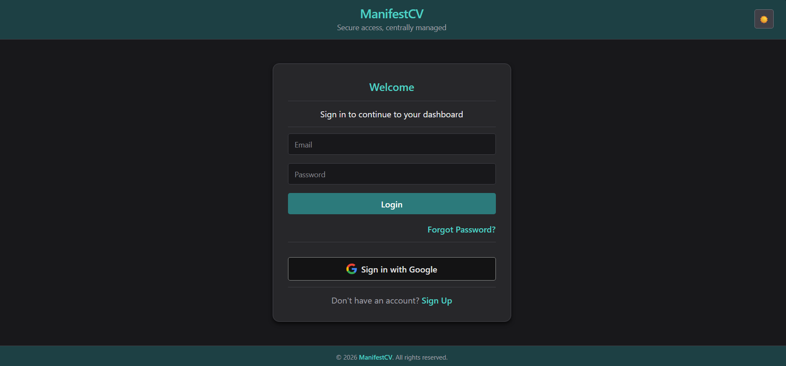
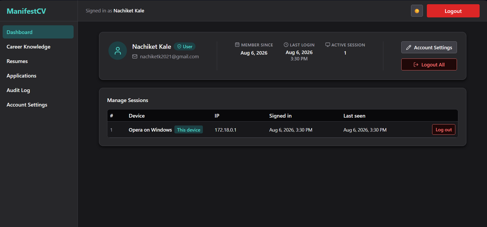
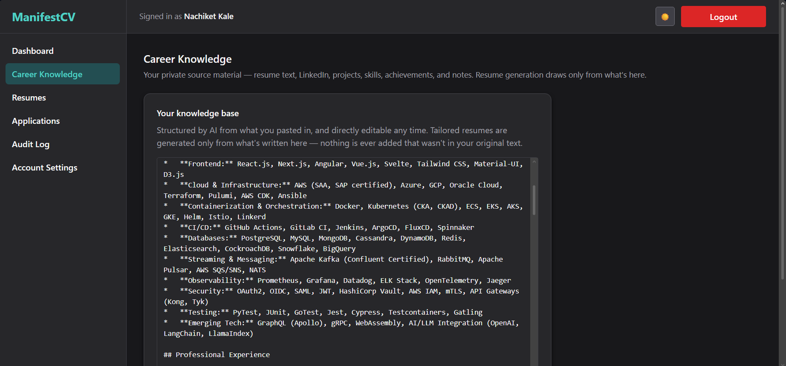
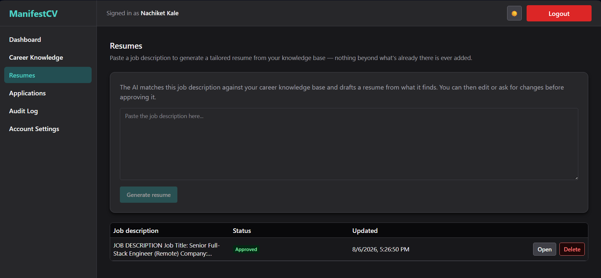
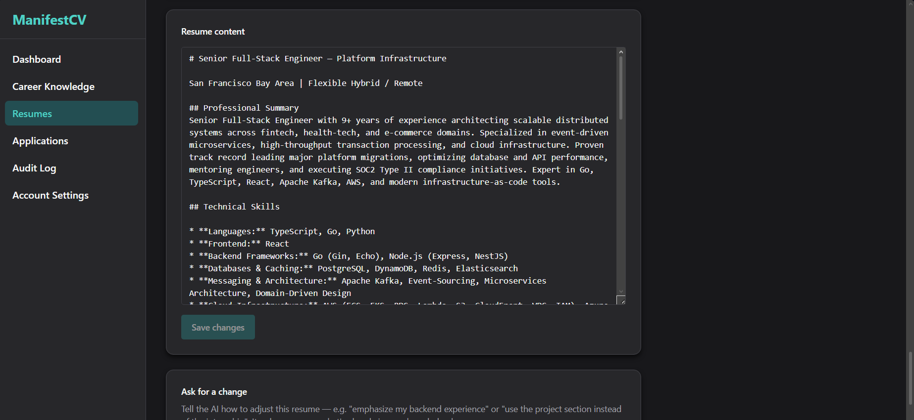
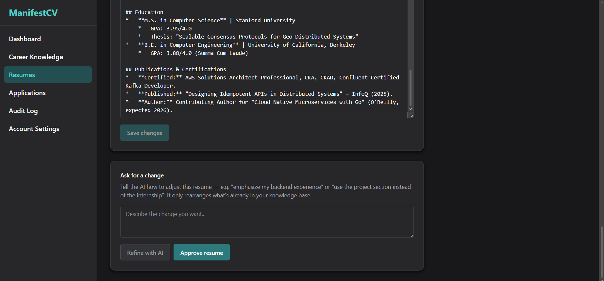
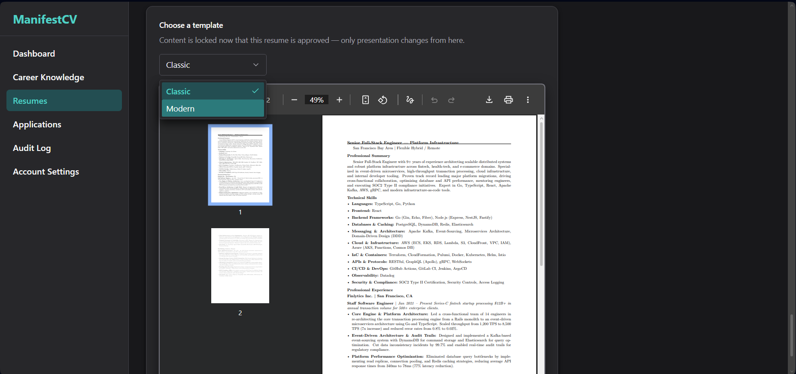
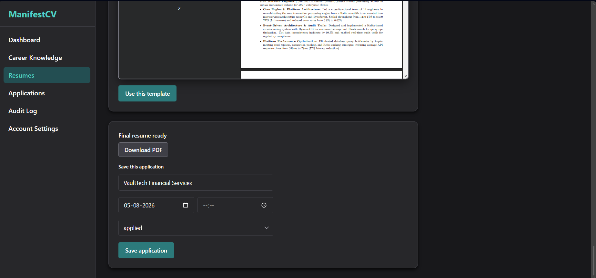
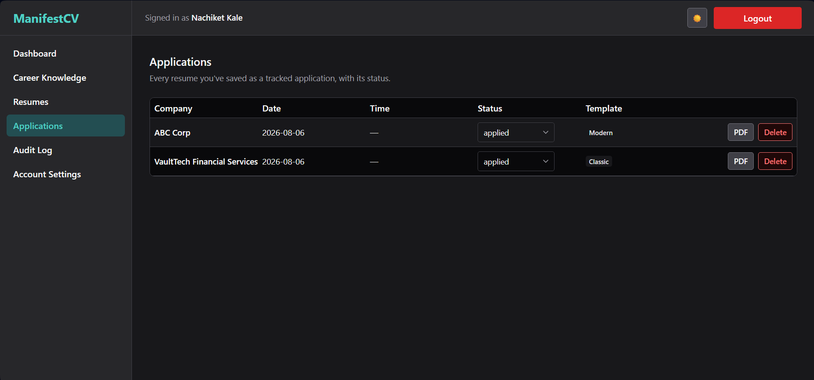

# ManifestCV


---

## Overview

ManifestCV turns one private career knowledge base into tailored, AI-assisted resumes for each job description. Paste your career material once. ManifestCV structures it, retrieves the relevant sections for each role, generates and refines a resume from them, then compiles and tracks the result.

Identity, sessions, and access control are provided by [mystic-auth](https://github.com/Nachiket-2024/mystic-auth), a full-stack auth/PBAC template, vendored in unmodified. See [Auth & Authorization](docs/app/auth/overview.md) for how ManifestCV is wired to it, and the [mystic-auth repository](https://github.com/Nachiket-2024/mystic-auth) itself for everything about how login, OAuth2, and policy-based access control actually work.

See [`docs/README.md`](docs/README.md) for architecture, product features, database, API reference, testing, Docker, CI/CD, and deployment.

---

## Screenshots

### Login Page


---

### Dashboard


---

### Career Knowledge


---

### Resumes


---

### Resume Content


---

### Resume Refinement


---

### Template Preview


---

### Save Application


---

### Applications


---

## ✨ Features

- **Career Knowledge Base**: paste in your resume, LinkedIn export, project notes, whatever you have. Gemini structures it into clean, editable Markdown, always directly re-editable by hand afterward. See [Career Knowledge](docs/app/career-knowledge/overview.md).
- **Semantic Retrieval**: your knowledge base is chunked and embedded into Qdrant, so resume generation retrieves only the sections relevant to a specific job description instead of dumping everything into one prompt. See [AI & Retrieval](docs/app/ai-and-retrieval/overview.md).
- **AI-Assisted Resume Drafting**: generate an initial tailored resume from a job description, then refine it with natural-language instructions that re-match the knowledge base rather than just rephrasing the existing text. See [Resumes](docs/app/resumes/overview.md).
- **PDF Document Generation**: once approved, compile a resume to a polished PDF via a Markdown→LaTeX pipeline and a self-contained `tectonic` engine. No LaTeX installation required, and multiple visual templates to choose from. See [Document Generation](docs/app/document-generation/overview.md).
- **Application Tracking**: save a finalized resume against a job application. The resume content, template, and PDF are snapshotted at that moment, so tracked applications survive later edits to the source draft. See [Applications](docs/app/applications/overview.md).
- **Real authentication, not a demo login**: email+password with Argon2 hashing, Google OAuth2/PKCE, JWT access+refresh tokens as httpOnly cookies, refresh-token rotation with reuse detection, rate limiting, and audit logging. All inherited from mystic-auth. See [Auth & Authorization](docs/app/auth/overview.md).
- **Error monitoring, on by default**: backend and frontend exceptions reported to self-hosted Bugsink (started automatically by `docker compose up`) or Sentry's hosted free tier, via the Sentry SDK protocol. See [Error Monitoring](docs/mystic_auth/error-monitoring/overview.md).

---

## Stack

- **Backend:** FastAPI (fully async), SQLAlchemy 2.0 (async, `asyncpg`), Alembic migrations
- **AI:** Google Gemini. Text generation (structuring, resume generation/refinement) and embeddings
- **Retrieval:** Qdrant. Self-hosted vector search over per-user career knowledge chunks
- **Document generation:** Markdown → LaTeX → `tectonic` (self-contained LaTeX engine, no TeX Live install)
- **Authentication:** Email + Password (Argon2 hashing, JWT access & refresh tokens), Google OAuth2 with PKCE. Via mystic-auth
- **Frontend:** TypeScript, React 19 + Vite, Chakra UI v3
- **State Management:** Zustand (client/session state) + TanStack Query (server state/caching)
- **Database:** PostgreSQL (async)
- **Caching & Tasks:** Redis + Taskiq (async background email delivery)
- **Error monitoring:** Sentry SDK protocol, self-hosted Bugsink by default (or Sentry's hosted free tier)
- **Deployment:** Docker (dev and production Compose files)

---

## 📥 Installation

### 1. Clone the repository

```bash
git clone <this-repository-url>
cd manifest-cv
```

### 2. Set up the environment (only if running locally. Skip if using Docker)

> Instructions below assume that you are at the root of the repository while running the commands.

Install backend dependencies:

```bash
cd backend
pip install -r requirements.txt
```

Install frontend dependencies:

```bash
cd frontend
npm install
```

---

## Environment Variables

> Instructions below assume that you are at the root of the repository while running the commands.

All environment variables, backend and frontend (`VITE_*`) alike, are defined in one place: root `.env.example`. Copy it to `.env` and fill in your own values:

```bash
cp .env.example .env
```

`SECRET_KEY` must be at least 32 characters, or the app refuses to start. `GEMINI_API_KEY` is also required (the backend won't start without it). Get a free-tier key at [aistudio.google.com/apikey](https://aistudio.google.com/apikey). `QDRANT_URL` defaults to the Docker-networked `qdrant` service and needs no separate signup.

`.env.local-prod.example` is for self-hosting with Cloudflare Tunnel and no
server. `.env.prod.example` is for your own server with a public IP, where this
Compose stack owns TLS through Caddy. See
[Choosing the right env template](docs/mystic_auth/deployment/guide.md#choosing-the-right-env-template)
before switching modes.

---

## Run the App

> Instructions below assume that you are at the root of the repository while running the commands.

> To enable Google login, configure your Google Cloud project and OAuth API first (see [mystic-auth's OAuth2/PKCE docs](docs/mystic_auth/authentication/oauth2-pkce.md) for the exact `GOOGLE_REDIRECT_URI` requirement). The app runs without it. Only Google login specifically won't work until it's configured.

### Path 1. Docker (Recommended)

Use the helper script for your shell:

```bash
# Git Bash, WSL, Linux, macOS
./scripts/docker/dev-up.sh
```

```powershell
# PowerShell
.\scripts\docker\dev-up.ps1
```

```bat
rem Command Prompt
scripts\docker\dev-up.cmd
```

Starts every service, waits for each to actually report healthy, then prints a one-line-per-service status table and settles into tailing fresh logs from just `backend`/`frontend`/`taskiq_worker`: their startup lines, API calls, the frontend dev server, and async email-task execution. Postgres/Redis/Bugsink/Alembic startup noise stays out of the way since they've already done their job by the time the tail starts. Backend exceptions still go to Bugsink ([http://localhost:8010](http://localhost:8010)), not this terminal. See [Docker Overview](docs/mystic_auth/docker/overview.md#day-to-day-dev-up-helpers) for the full rationale and what to do if a service fails to start.

Want every service's full logs interleaved in one stream instead, for example while debugging Postgres, Bugsink, or Taskiq startup? Plain `docker compose up` still does exactly that:

```bash
docker compose up
```

Once the services are running:

- **Backend:** [http://localhost:8000/docs](http://localhost:8000/docs). FastAPI API docs and endpoints
- **Frontend:** [http://localhost:5173](http://localhost:5173). React + Vite frontend
- **PostgreSQL:** `localhost:5433`. Database ready for connections (non-default host port; containers reach it at `postgres:5432` internally)
- **Redis:** `localhost:6380`. Cache, rate limiting, and Taskiq broker (non-default host port; containers reach it at `redis:6379` internally)
- **Qdrant:** `localhost:6333`: Vector store for career knowledge retrieval
- **Taskiq worker:** Automatically listens for async tasks (email sending)
- **Alembic migrations:** Run automatically on stack startup via the dedicated `alembic` service (`alembic upgrade head`). Applies mystic-auth's inherited schema and ManifestCV's own tables in one pass

> **Self-hosted error monitoring (Bugsink) is part of both paths above**: `scripts/docker/dev-up.sh`, `scripts/docker/dev-up.ps1`, `scripts/docker/dev-up.cmd`, and plain `docker compose up` all start it by default at `localhost:8010`, matching mystic-auth's own template default. A one-shot seeding container creates a default project and wires its DSN into `backend`/`frontend` automatically, no setup needed. See [Error Monitoring](docs/mystic_auth/error-monitoring/overview.md) for how it works and how to point at Sentry's hosted tier instead if you'd rather not run it locally.

See [Docker Overview](docs/app/docker/overview.md) for the full service breakdown and [Deployment Guide](docs/app/deployment/guide.md) for production Compose usage and free/low-cost hosting options.

> The two paths below cover local development. Self-hosting behind a Cloudflare Tunnel (`docker-compose.local-prod.yml`) or running on your own internet-facing server (`docker-compose.prod.yml`) are separate modes with their own `docker compose -f <file> up -d --build` commands, env templates, and tradeoffs, covered in full in the [Deployment Guide](docs/app/deployment/guide.md#choosing-the-right-env-template). They're mentioned again below under [Creating the System Superuser](#-first-time-setup-creating-the-system-superuser), which has commands for all four run modes (dev Docker, local-prod Docker, prod Docker, and no-Docker local).

---

### Path 2. Running Locally

> Make sure PostgreSQL is running locally and the database exists.
> Redis and Qdrant can be run locally or via Docker.

#### 1. Run Alembic Migrations

```bash
cd backend
alembic upgrade head
```

#### 2. Start the FastAPI backend

Run from the repo root. `app/` (ManifestCV) and `mystic_auth/` (vendored template) are separate top-level packages under `backend/`, bridged via `app/sdk.py`'s import helper, which resolves correctly whether `backend/` is on `sys.path` (this command, or `uvicorn`'s own cwd auto-insertion) or `backend` itself is (Docker's `WORKDIR /app`). See [Auth & Authorization](docs/app/auth/overview.md).

```bash
uvicorn backend.app.main:app --reload
```

- **Backend:** [http://localhost:8000/docs](http://localhost:8000/docs)
- **PostgreSQL:** `localhost:5432`
- **Redis:** `localhost:6379`
- **Qdrant:** `localhost:6333`

#### 3. Start the Taskiq Worker

```bash
taskiq worker backend.mystic_auth.taskiq_tasks.email_tasks:broker --reload
```

#### 4. Run the React frontend

```bash
cd frontend
npm run dev
```

- **Frontend:** [http://localhost:5173](http://localhost:5173)

> **Error monitoring (Bugsink) still requires Docker even in this local-run path**: it only ships as a container in this template, with no bare-metal install documented. Run `docker compose up bugsink bugsink-seed` alongside your locally-run backend/frontend if you want it. See [Error Monitoring](docs/mystic_auth/error-monitoring/overview.md).

---

## 🔑 First-Time Setup: Creating the System Superuser

After starting the app for the first time, create the reserved system account: a one-time step inherited from mystic-auth that seeds the account holding the `system_superuser` policy.

> Commands below assume you're at the root of the repository, unless a `cd` is shown explicitly.

### Dev Docker

```bash
docker compose exec -it backend python -m mystic_auth.scripts.create_system_user
```

### Local-prod Docker

Use this when you started the self-hosted Cloudflare Tunnel stack:

```bash
docker compose -f docker-compose.local-prod.yml exec -it backend python -m mystic_auth.scripts.create_system_user
```

### Prod Docker

Run this on the server where `docker-compose.prod.yml` is running:

```bash
docker compose -f docker-compose.prod.yml exec -it backend python -m mystic_auth.scripts.create_system_user
```

### Local Backend Without Docker

```bash
cd backend
python -m mystic_auth.scripts.create_system_user
```

You will be prompted to enter a name, email, and password interactively. This only needs to be run once. The system user persists in the database volume and can never be created, modified, or promoted via any API endpoint.

---

## Notes

- All credentials and secrets are loaded from `.env`
- **Alembic** is used for database migrations
- **Redis + Taskiq** are used for async email delivery, caching, and rate limiting
- **Qdrant** is used for semantic search over each user's career knowledge base
- OAuth2 setup requires Google Cloud credentials. AI features require a Gemini API key
- Error monitoring (self-hosted Bugsink) starts automatically with `docker compose up`. See [Error Monitoring](docs/mystic_auth/error-monitoring/overview.md)
- **Zustand** manages client-side session state. **TanStack Query** manages all server-state caching
- **Type Safety:** Full TypeScript support across the frontend (`mystic_auth/ui/`, `mystic_auth/authorization/`, `mystic_auth/store/`, and every feature domain)

---

## Documentation

Full documentation lives in [`docs/`](docs/README.md), organized by feature/domain:

- [Architecture](docs/app/README.md#architecture) (system overview, backend, frontend)
- [Auth & Authorization](docs/app/auth/overview.md): the boundary with mystic-auth
- [Career Knowledge](docs/app/career-knowledge/overview.md), [Resumes](docs/app/resumes/overview.md), [Document Generation](docs/app/document-generation/overview.md), [Applications](docs/app/applications/overview.md)
- [AI & Retrieval](docs/app/ai-and-retrieval/overview.md)
- [Database Design](docs/mystic_auth/database/design.md) (inherited schema) + [ManifestCV's Own Tables](docs/app/database/design.md)
- [API Reference](docs/app/api/reference.md)
- [Background Workers](docs/mystic_auth/background-workers/taskiq.md)
- [Testing](docs/app/testing/overview.md)
- [Error Monitoring](docs/mystic_auth/error-monitoring/overview.md). On by default. Self-hosted Bugsink or Sentry's hosted tier
- [Docker](docs/app/docker/overview.md)
- [CI/CD](docs/app/cicd/overview.md)
- [Deployment](docs/app/deployment/guide.md)
- [Known Issues & Concerns](docs/app/concerns/README.md)

For the underlying authentication/authorization system itself, how login, OAuth2, JWT/cookie handling, and Policy-Based Access Control actually work, see [mystic-auth](https://github.com/Nachiket-2024/mystic-auth) and its own documentation.

---

## License

This project is licensed under the MIT License. See [LICENSE](LICENSE) for details.
