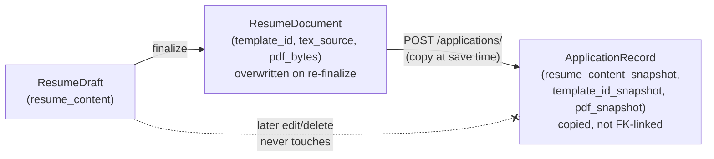

# Applications

Tracks the job applications a user has actually sent, snapshotting the resume that was used at the moment it was saved. Backend: `application_table/`, `application_crud/`, `api/application_routes/`. Frontend: `frontend/src/app/applications/`.

---

## The model

`ApplicationRecord` (`application_records` table), many per user. Deliberately **self-contained**: `resume_content_snapshot`, `template_id_snapshot`, and `pdf_snapshot` are copied at save time, not stored as a foreign key back to the `ResumeDraft`/`ResumeDocument` that produced them:

| Column | Purpose |
|---|---|
| `company_name`, `application_date`, `application_time` | Identifying/tracking fields. `company_name` capped at 200 characters (`ApplicationCreate`/`Update` schemas) |
| `status` | One of `applied`, `interviewing`, `offered`, or `rejected`, matching `ApplicationStatus` and the frontend selectors |
| `resume_content_snapshot`, `template_id_snapshot`, `pdf_snapshot` | An immutable copy of the resume as it was when the application was saved |

This is deliberate: a tracked application must survive the user later editing or deleting the draft/document it came from. Unlike the career knowledge base, which has no meaning without its owner and cascades on delete, this data's whole purpose is *outliving its source*. `application_records.user_id` still cascades on account deletion, but nothing about a `ResumeDraft`/`ResumeDocument` change ever touches an already-saved application.

---

## Flow

1. **Create** (`POST /applications/`). The caller supplies `resume_draft_id` plus tracking fields. The draft must exist, belong to the caller, and already have a finalized document (see [Document Generation](../document-generation/overview.md)). Otherwise `400 Bad Request` ("Finalize this resume ... Before saving an application"). The resume content, template id, and PDF bytes are copied server-side from that document. The client never supplies them directly.
2. **List / Get** (`GET /applications/`, `GET /applications/{id}`). The list view uses a summary schema (excludes the Markdown/PDF snapshot to stay lightweight). The detail view includes the Markdown snapshot (not the raw PDF bytes).
3. **Update** (`PATCH /applications/{id}`). Tracking fields only (company/date/time/status), as an application progresses through its lifecycle. The resume snapshot itself is read-only once saved.
4. **Download PDF** (`GET /applications/{id}/pdf`). Returns the snapshotted PDF bytes as an attachment.
5. **Delete** (`DELETE /applications/{id}`).

---

## Ownership and access

No PBAC permission required. Every route is scoped to the caller's own `user_id` (see [Auth & Authorization](../auth/overview.md#no-pbac-on-manifestcvs-own-routes)). Both the source draft lookup and the application itself are ownership-checked, so a caller can't snapshot another user's finalized resume by guessing a `resume_draft_id`.

---

## Pagination

`GET /applications/` accepts `limit` (default 20, max 100) and `offset` (default 0) query params, newest-first (`application_date.desc()`, then `created_at.desc()`, then `id.desc()` as a final tie-breaker for a fully stable sort). Same convention as [Resumes' own list endpoint](../resumes/overview.md#pagination) and the inherited audit-log endpoints. The frontend (`ApplicationsPage.tsx`) drives this with the same `ui/Pager.tsx` control.

---

## API reference

See [API Reference](../api/reference.md) (Applications section) for the full request/response shapes.
