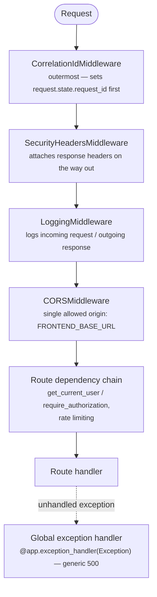

# Backend Architecture

## Purpose

FastAPI application (`backend/`), async throughout — SQLAlchemy async engine, async Redis client, async SMTP, async Qdrant client. One codebase, three container roles (`backend`, `taskiq_worker`, `alembic`) built from the same image with different `command:` overrides — see [Docker Overview](../docker/overview.md).

The app is two layers, kept in physically separate top-level Python packages: an identity/authorization foundation vendored from [mystic-auth](https://github.com/Nachiket-2024/mystic-auth) (`backend/mystic_auth/` — `api/auth_routes/`, `api/pbac_routes/`, `api/user_routes/`, `auth/`, `authorization/`, `user_crud/`, `user_table/`, `audit_log/`), and ManifestCV's own product domains built on top of it (`backend/app/` — `career_knowledge_*`, `resume_*`, `application_*`, `document_generation/`, `ai_integration/`, `retrieval/`, plus the extension-surface files below). The only bridge between the two is `backend/app/sdk.py` — this repo's own copy of mystic-auth's extension-surface convention, re-exporting mystic-auth's internals (`get_current_user`, `require_authorization`, `database`, `settings`, `rate_limiter_service`, etc.) for `backend/app/`'s own code to import — plus `backend/app/app_sdk.py`, ManifestCV's own small id-resolution helper, kept in a separate file from `sdk.py` specifically so a template update never conflicts with something ManifestCV added — see [Auth & Authorization](../auth/overview.md). Because they're sibling top-level packages rather than one nested under the other, a plain absolute `mystic_auth.*` import would only resolve inside the Docker image (`WORKDIR /app`), not from the repo root the test suite runs from. `sdk.py` is the one file that crosses the boundary, and it does so via an `importlib`-based helper that derives the correct prefix (`mystic_auth` under Docker, `backend.mystic_auth` from the repo root) from its own `__package__` at runtime — see [Auth & Authorization](../auth/overview.md). Everything else, within either package, stays relative exactly as before the split.

## Module layout

### `backend/mystic_auth/` — inherited from mystic-auth

| Module | Purpose |
|---|---|
| `api/auth_routes/`, `api/user_routes/`, `api/pbac_routes/`, `api/audit_log_routes/`, `api/health_routes/` | Route registration only — one `APIRouter` per feature, no business logic |
| `auth/` | Authentication: signup, login, logout, logout-all, refresh-token rotation, password reset, account verification, Google OAuth2/PKCE, JWT/cookie handling, security middleware/rate limiting (`auth/security/`) |
| `authorization/` | PBAC engine: policies, conditions, evaluator, caching, its own audit log |
| `audit_log/` | Security/session-event audit log (`security_audit_log` table) — distinct from the PBAC audit log |
| `core/` | Cross-cutting config: `settings.py` (pydantic-settings, env-driven) — extended with ManifestCV's own AI/retrieval settings, see below |
| `database/` | `connection.py` — async SQLAlchemy engine/session factory; `base.py` — declarative base |
| `emails/` | HTML email template rendering, SMTP transport, address normalization — used by the taskiq email tasks |
| `logging/` | Structured, module-scoped loggers; correlation-ID and request/response logging middleware |
| `redis/` | Single async Redis client, shared by rate limiting, lockout, caching, token registries, and taskiq's broker |
| `scripts/` | `create_system_user.py` — one-off interactive CLI to bootstrap the reserved system account |
| `taskiq_tasks/` | The async email-sending task and its broker — see [Background Workers](../../mystic_auth/background-workers/taskiq.md) |
| `user_crud/`, `user_table/` | CRUD orchestration and SQLAlchemy model/schema for the `users` table |
| `error_monitoring/` | `sentry_service.py` — optional, disabled unless `SENTRY_DSN` is set; a no-op otherwise — see [Error Monitoring](../../mystic_auth/error-monitoring/overview.md) |

Unlike a fresh, standalone clone of the template (where `sdk.py`/`app_sdk.py` live inside `mystic_auth/` itself), this repo keeps mystic-auth's own package free of any downstream-extension file — see `backend/app/`'s own `sdk.py`/`app_sdk.py` below. For how any of these modules actually work internally, see [mystic-auth's own docs](https://github.com/Nachiket-2024/mystic-auth/tree/main/docs/mystic_auth) — this repo doesn't duplicate that documentation, only what ManifestCV adds on top of it or depends on from it.

### `backend/app/` — ManifestCV's own domains

| Module | Purpose |
|---|---|
| `sdk.py` | The public extension surface for `backend/app/`'s own code — re-exports mystic-auth's internals (`get_current_user`, `require_authorization`, `Permission`, `database`, `settings`, `capture_exception`, `rate_limiter_service`, routers, middleware, etc.) so ManifestCV's route modules import from `app.sdk` rather than reaching into `mystic_auth`'s internal paths directly — see [Auth & Authorization](../auth/overview.md) |
| `app_sdk.py` | ManifestCV's own id-resolution helper (`get_user_id_by_email`) — the counterpart to `sdk.py`, for glue mystic-auth has no reason to provide, kept in its own file so a template update to `sdk.py` never conflicts with it — see [Auth & Authorization](../auth/overview.md) |
| `career_knowledge_table/`, `career_knowledge_crud/`, `api/career_knowledge_routes/` | One knowledge base per user — see [Career Knowledge](../career-knowledge/overview.md) |
| `resume_table/`, `resume_crud/`, `api/resume_routes/` | Tailored resume drafts per job description — see [Resumes](../resumes/overview.md) |
| `resume_document_table/`, `resume_document_crud/`, `document_generation/`, `api/document_routes/` | Compiled PDF resumes — see [Document Generation](../document-generation/overview.md) |
| `application_table/`, `application_crud/`, `api/application_routes/` | Tracked job applications — see [Applications](../applications/overview.md) |
| `ai_integration/`, `retrieval/` | Gemini text generation/embeddings and Qdrant vector search — see [AI & Retrieval](../ai-and-retrieval/overview.md) |
| `main.py` | App entrypoint: middleware registration, router mounting (mystic-auth's routers plus ManifestCV's four), global exception handler, lifespan (Qdrant collection bootstrap on startup; DB pool / Redis / Qdrant client cleanup on shutdown). Stays under `app/` — and remains the `uvicorn app.main:app` / `backend.app.main:app` entrypoint everywhere (Docker, local, tests) — rather than moving to `mystic_auth/`, since it's the actual composition root that mounts both packages' routers together |

`main.py` never imports across the `mystic_auth`/`app` boundary directly — it pulls in mystic-auth's settings, routers, middleware, and DB/Redis singletons via a plain relative `from .sdk import ...`, the same way every other ManifestCV module does; `sdk.py` itself is the one file that actually crosses the boundary (see above), then `main.py` mounts ManifestCV's own routers via its usual relative imports within `app/`.

## Request pipeline

Starlette applies middleware in reverse of add order, which is why `CorrelationIdMiddleware` is added *last* in `main.py` to end up *outermost* — see the inline comment there for the exact reasoning.

In production (`ENVIRONMENT=production`), `/docs`, `/redoc`, and `/openapi.json` are disabled entirely (`main.py`) — one less surface to lock down at a reverse proxy.

## Configuration

All configuration is centralized in `mystic_auth/core/settings.py` (`pydantic-settings`, loaded from `.env`) — every setting is documented inline there with a one-line comment. No module reads an environment variable directly outside of `settings`. `GEMINI_API_KEY`, `GEMINI_MODEL`, `GEMINI_EMBEDDING_MODEL`, and `QDRANT_URL` are ManifestCV's own additions to the inherited settings list. See `.env.example` for the full list, grouped by category.

## Database layer

SQLAlchemy 2.0, fully async (`asyncpg` driver). `mystic_auth/database/connection.py`'s `Database` class wraps the async engine and session factory; a module-level `database` singleton is imported everywhere a session is needed (`Depends(database.get_session)`). Schema is managed entirely through Alembic migrations (`backend/alembic/versions/`) — no `create_all()` anywhere in application startup. ManifestCV's four tables chain directly after mystic-auth's own migration history rather than branching — see [Database Design](../../mystic_auth/database/design.md).

## Error handling

Two layers:
1. **Expected failures** — routes/services raise `HTTPException` with a specific status code and `detail`. ManifestCV's AI-backed routes (career knowledge, resumes) additionally translate `AIIntegrationError` into `502 Bad Gateway` — a failure of an upstream dependency (Gemini), not the caller's request.
2. **Unexpected failures** — `main.py`'s global exception handler catches anything that escapes the first layer, logs the full traceback, and returns a generic `500` with no internal detail.

## Logging

Structured, module-scoped loggers via `mystic_auth/logging/logging_config.py::get_logger(__name__)` throughout. Every request gets a correlation ID (`CorrelationIdMiddleware`) attached to every log line emitted while handling it, making it possible to grep `docker compose logs backend` for one request's full trail.

## Testing coverage

`tests/backend/mystic_auth/{unit,integration,security,performance}/` cover the inherited mystic-auth foundation (`backend/mystic_auth/`); `tests/backend/app/{unit,integration}/` cover ManifestCV's own domains (`backend/app/`) — see [Testing Overview](../testing/overview.md).
