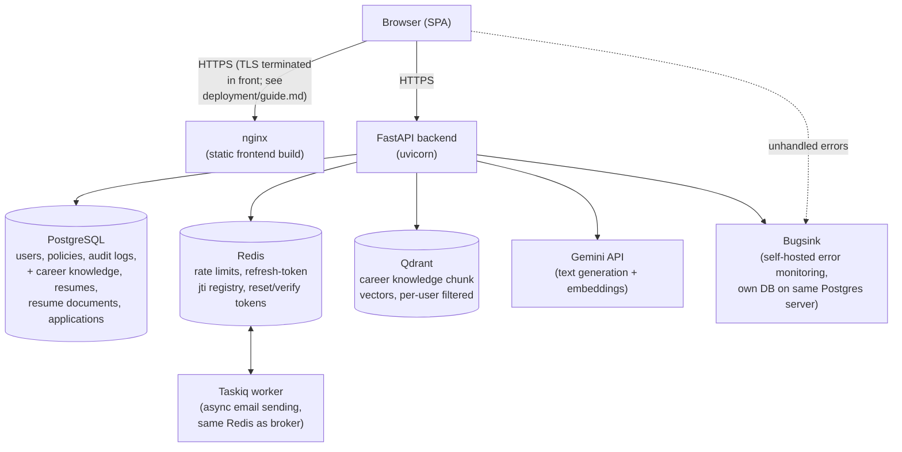
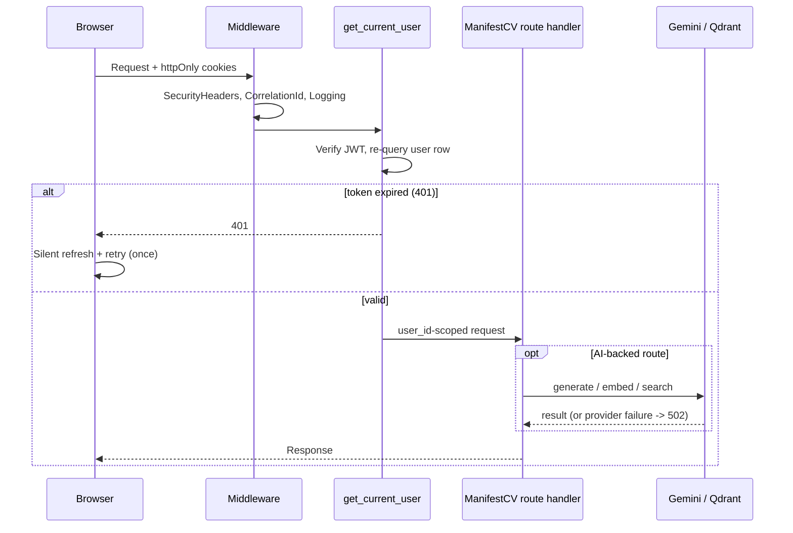

# System Architecture

High-level overview of the whole stack. For deployment/runtime topology, see [../deployment/guide.md](../deployment/guide.md). For how identity/authorization fits in, see [Auth & Authorization](../auth/overview.md).

---

## Components

- **Frontend**: React + TypeScript + Chakra UI + Zustand (client state) + TanStack Query (server state). Built as a static SPA, served by nginx in production (`docker-compose.prod.yml`) or Vite's dev server locally (`docker-compose.yml`). Inherited from mystic-auth, extended with ManifestCV's own `career_knowledge/`, `resumes/`, `applications/` pages.
- **Backend**: FastAPI, async throughout (SQLAlchemy async engine, async Redis client, async Qdrant client). One process type (`backend/app/main.py`), shared by the `backend`, `taskiq_worker`, and `alembic` containers via the same Docker image (`docker/backend.Dockerfile`) with different `command:` overrides. Also runs `tectonic` (a bundled LaTeX engine) for PDF resume compilation.
- **PostgreSQL**: system of record. Users, policies, policy history, both audit log tables (inherited from mystic-auth), plus ManifestCV's own `career_knowledge_bases`, `resume_drafts`, `resume_documents`, `application_records`.
- **Redis**: ephemeral/derived state only, never the source of truth for anything that must survive a flush. Rate-limit/lockout counters, the refresh-token jti revocation registry, single-use password-reset/email-verification/OAuth2-state tokens (all with TTLs matching their expiry). Also Taskiq's broker/result backend.
- **Taskiq worker**: consumes an async task queue (Redis stream) for one job today. Sending email (verification, password reset). So a request handler returns immediately instead of blocking on SMTP.
- **Qdrant**: ManifestCV's vector store. One shared collection (`career_knowledge_chunks`), isolated per user via a payload filter, holding embeddings of each user's career knowledge base sections for semantic search. See [AI & Retrieval](../ai-and-retrieval/overview.md).
- **Gemini API**: ManifestCV's AI provider. Text generation (structuring raw career input, generating/refining resumes) and embeddings (indexing/searching the knowledge base). The only external network dependency in an otherwise fully self-hosted stack.
- **Bugsink**: self-hosted error monitoring, enabled by default. Starts with `docker compose up` alongside everything else. Backend and frontend both report unhandled exceptions to it over the Sentry SDK wire protocol. Runs as its own container, using a second database on the same Postgres server (not a second Postgres instance). Inherited from mystic-auth. See [Error Monitoring](../../mystic_auth/error-monitoring/overview.md).

---

## Why this split

- **Redis vs. Postgres**: everything in Redis is either a cache, a rate/lockout counter, or a single-use token. Losing it on a restart degrades gracefully (a user re-requests a password reset, a rate limit resets) rather than corrupting state. Nothing that needs to survive indefinitely (users, policies, audit history, resumes, applications) lives there.
- **Taskiq for email**: email delivery is the one slow, failure-prone I/O call in the auth flows (SMTP to an external provider). Queuing it means signup/password-reset requests aren't held open waiting on a mail server, and a transient SMTP failure doesn't fail the HTTP request that triggered it.
- **One backend image, three roles**: `backend`, `taskiq_worker`, and `alembic` all run from `docker/backend.Dockerfile` with different commands, rather than three separate images. Keeps dependency versions/code identical across all three by construction.
- **Qdrant alongside Postgres, not instead of it**: Postgres stores the durable, structured record (the knowledge base's actual Markdown content). Qdrant only stores derived, rebuildable vectors of that content for semantic search. Losing the Qdrant collection is a re-index away from being fixed, never data loss.

---

## Request lifecycle (authenticated request)

1. Browser sends a request with `access_token`/`refresh_token` httpOnly cookies (never accessible to frontend JS).
2. `SecurityHeadersMiddleware` and `CorrelationIdMiddleware`/`LoggingMiddleware` wrap every request (see `backend/app/main.py`).
3. `Depends(get_current_user)` (mystic-auth's dependency, imported by ManifestCV's own routes from `app.sdk`: see [Auth & Authorization](../auth/overview.md)) verifies the JWT and re-queries the user row. For PBAC-gated mystic-auth routes, `Depends(require_authorization(action, resource_type))` additionally resolves the caller's current permissions from their assigned policies. ManifestCV's own routes (career knowledge, resumes, applications) skip PBAC entirely. Every result is scoped by `user_id` at the query level instead.
4. On a 401 specifically, `frontend/src/mystic_auth/auth/setupAuthInterceptor.ts` attempts one silent refresh-and-retry before giving up and marking the session invalid.
5. The route handler runs. For ManifestCV's AI-backed routes, this may include a Gemini call (text generation/embedding) and/or a Qdrant call (index/search) before the response is returned. Both wrapped so a provider failure surfaces as `502 Bad Gateway`, not an unhandled `500`.

---

## Database design

See [Database Design](../../mystic_auth/database/design.md) for mystic-auth's inherited schema, and [ManifestCV's Own Tables](../database/design.md) for the four product tables.
