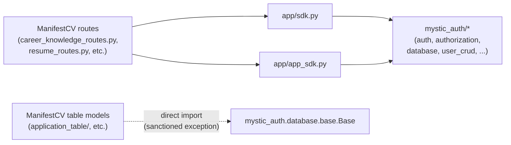

# Auth & Authorization

ManifestCV doesn't implement its own authentication or authorization — it's built on [mystic-auth](https://github.com/Nachiket-2024/mystic-auth), a full-stack identity/PBAC template, vendored in unmodified. The vendored code and ManifestCV's own product code are kept in physically separate top-level packages, the same way mystic-auth's own template now ships by default: `backend/mystic_auth/` + `frontend/src/mystic_auth/` (mystic-auth's own internals) versus `backend/app/` + `frontend/src/app/` (ManifestCV's own domains — resumes, career knowledge, applications, document generation — plus the extension-surface files described below). For how login, signup, OAuth2, tokens, PBAC policies, or audit logging actually work, see the [Foundation (mystic-auth)](../README.md#foundation-mystic-auth) section of the docs index, starting with [Authentication Overview](../../mystic_auth/authentication/overview.md) and [PBAC Architecture](../../mystic_auth/authorization/architecture.md).

What's documented here is the ManifestCV-specific part: how ManifestCV's own product code reaches into that foundation without becoming tightly coupled to it — a boundary that predates the physical folder split above and is what made that split mechanical rather than a rewrite (see [Why loose, not tight](#why-loose-not-tight)).

## The boundary: `backend/app/sdk.py` + `backend/app/app_sdk.py`

mystic-auth's own template convention is for the downstream product (`app/`) to own a `sdk.py` (re-exporting the template's building blocks — **upstream-owned, never hand-edited**, since a `scripts/sync-upstream.sh` merge is expected to touch it cleanly every time) and an `app_sdk.py` (shipped empty, kept exclusively for the product's own re-exports so it never conflicts on a sync) — see its `docs/mystic_auth/template-usage.md#the-app--mystic_auth-split`. ManifestCV follows this exactly: `backend/app/sdk.py` is a byte-for-byte copy of upstream's, and `backend/app/app_sdk.py` holds every piece of mystic-auth-adjacent glue ManifestCV itself needs — both identity/id-resolution and the two pieces of generic infrastructure below. ManifestCV's feature code imports from exactly these two places, neither of which reaches into mystic-auth's internals directly:

- **`get_current_user`** — imported from `app.sdk`, which re-exports `mystic_auth.auth.current_user.current_user_dependency.get_current_user` unchanged. Every ManifestCV route depends on the exact same dependency mystic-auth's own routes use, so session/cookie/token behavior is identical everywhere. Sourcing through `app.sdk` rather than mystic-auth's internal path directly means an upstream rename only ever needs fixing in one file — not every ManifestCV route module.
- **`get_user_id_by_email`** — a small translation function ManifestCV owns itself, in `backend/app/app_sdk.py` (not part of mystic-auth's template; there's nothing to reconcile against upstream here). mystic-auth's `get_current_user` returns a dict (`email`, `role`, `permissions`), never a database id. ManifestCV's own tables (`resume_drafts`, `career_knowledge_bases`, `application_records`) foreign-key on `user_id`, so every owner-scoped route resolves the caller's id once per request via this function (`user_crud.get_by_email(email, db).id`).
- **`get_logger`, `rate_limiter_service`** — also in `app_sdk.py`, not `sdk.py`. An earlier revision added both directly to `sdk.py`'s re-export list, which worked but quietly broke the one rule that file exists to enforce (see the box above) — the next sync would have had to reconcile a local edit against upstream's own version of that file instead of taking it as a clean drop-in. Moved to `app_sdk.py` instead, using the same `importlib`-based direct-module-path pattern as `get_user_id_by_email` above (see `app_sdk.py`'s own source for the exact mechanism) — neither is identity-specific, but both are genuine mystic-auth internals ManifestCV's own routes need, so routing them through the *product's* extension surface rather than `sdk.py` keeps the "don't hand-edit `sdk.py`" rule intact.



No ManifestCV route imports `mystic_auth.auth.current_user`, `mystic_auth.authorization`, `mystic_auth.user_crud`, `mystic_auth.auth.security`, or `mystic_auth.logging` directly — only `app.sdk` (`get_current_user`, `database`, `get_or_404`, `settings`, `capture_exception` — every one of these is a straight, unmodified re-export sourced from `mystic_auth.*` internals) and `app.app_sdk` (`get_user_id_by_email`, `get_logger`, `rate_limiter_service`). Exactly one thing is imported directly instead of through either extension surface: `mystic_auth.database.base` (the declarative `Base` every ManifestCV table model subclasses). This mirrors mystic-auth's own internal modules, which import `Base` the same direct way (e.g. `user_table/user_model.py`) — `sdk.py`'s own `database` export is the session/connection object, not the ORM base class, and a template's own model files were never expected to route through its extension surface for this. `get_logger` and `rate_limiter_service` are both generic, non-identity infrastructure ManifestCV's own routes need (`career_knowledge_routes.py`/`resume_routes.py`/`document_routes.py` use `rate_limiter_service` to throttle their AI/compute-triggering routes — see [Career Knowledge: rate limiting](../career-knowledge/overview.md#rate-limiting)) — neither is part of mystic-auth's own upstream `sdk.py` template (its own demo app has no need for them), and per the box above, `app_sdk.py` — not `sdk.py` — is where a downstream product adds re-exports like these.

Because `mystic_auth` and `app` are separate top-level Python packages (not nested — see [Backend Architecture](../architecture/backend.md)), a plain absolute `mystic_auth.*` import inside `app/sdk.py` would only resolve inside the Docker image (`WORKDIR /app`), not from the repo root the test suite runs from. `sdk.py`'s `_m()` helper resolves this at runtime instead, deriving the correct prefix (`mystic_auth` under Docker, `backend.mystic_auth` from the repo root) from its own `__package__`. Everything downstream of `sdk.py` — ManifestCV's own route modules — imports it back via ordinary relative imports within the `app` package, since `sdk.py` is now a sibling file inside their own package, not across the boundary:

```python
# The pattern every ManifestCV route follows:
from ...sdk import get_current_user, database, get_or_404
from ...app_sdk import get_user_id_by_email  # plus get_logger/rate_limiter_service where needed

@router.get("/")
async def list_my_resume_drafts(
    current_user: dict = Depends(get_current_user),
    db: AsyncSession = Depends(database.get_session),
):
    user_id = await get_user_id_by_email(current_user["email"], db)
    ...
```

## Why loose, not tight

This mirrors mystic-auth's own guidance for downstream products (see its `docs/mystic_auth/template-usage.md`, "Adding your own domain/resource" and "Protecting a new route"): a product built on the template owns its own top-level packages and mounts its own routers, importing only from the template's documented extension surface (`sdk.py` / `sdk.ts`) rather than its internals. Concretely, that buys two things:

1. **Upgrading mystic-auth stays cheap.** When the vendored code is refreshed from upstream, only `app/sdk.py` needs to be reconciled against the new internal shape (mystic-auth's own stated design goal for that file) — not every route module across `career_knowledge_*`, `resume_*`, `application_*`, and `document_generation`. `app/app_sdk.py` never needs touching for an upstream update at all — it's ManifestCV's own code, not a translation layer over mystic-auth internals.
2. **No mystic-auth code is ever edited to fit ManifestCV.** Every customization ManifestCV needs (routers mounted in `app/main.py`, settings appended in `mystic_auth/core/settings.py` — the one vendored file downstream products are expected to extend directly, per mystic-auth's own docs — cache-clearing behavior, etc.) lives in files ManifestCV owns or in narrow, clearly-marked additions to shared files — never inside mystic-auth's own `auth/`, `authorization/`, `user_crud/`, or `user_table/` modules. This same discipline is what let the two trees be physically split into `mystic_auth/` and `app/` folders without touching any of mystic-auth's own logic — every fix that split required was either a cross-package import rewrite (relative → absolute, since the two are now sibling packages) or an update to one of these already-documented seam files, never a change inside mystic-auth's own modules.

## No PBAC on ManifestCV's own routes

mystic-auth's routes are gated by `require_authorization(action, resource_type)` — Policy-Based Access Control. ManifestCV's own routes (career knowledge, resumes, applications, documents) deliberately don't use it: these are self-service, private-per-user resources (a user's own knowledge base, their own resume drafts), not resources where *who else* can act on *whose* data needs a policy decision. Ownership is enforced the simpler way — every query is scoped by the caller's own `user_id`, resolved via `get_user_id_by_email` above, so a caller-supplied id belonging to another user 404s rather than ever being reachable. This is the same reasoning mystic-auth itself applies to its own self-service routes (e.g. `GET /audit/security-log/me`).

## The frontend mirrors this

`frontend/src/app/career_knowledge/`, `resumes/`, and `applications/` never import from `mystic_auth/auth/`, `mystic_auth/authorization/`, `mystic_auth/store/authStore`, `mystic_auth/api/axiosInstance`/`mystic_auth/api/apiError`, or `mystic_auth/ui/*` directly. Identity/authorization pieces (`api`, `queryClient`, `extractApiErrorMessage`, `settings`, `useAuthStore`, `ProtectedRoute`, etc.) come from `frontend/src/app/sdk.ts`, the frontend counterpart to `backend/app/sdk.py` — same upstream-owned, never-hand-edited rule. The generic UI primitives (`PageContainer`, `Card`, `DataTable`, `ConfirmDialog`, `FormAlert`, `LoadingState`, `toaster`, `useUnsavedChangesWarning`) are mystic-auth's own `mystic_auth/ui/*`/`mystic_auth/profile/*` components with no identity concept of their own, but they're re-exported through `frontend/src/app/app_sdk.ts` — not `sdk.ts` — for the same reason `get_logger`/`rate_limiter_service` live in the backend's `app_sdk.py`: a downstream product's own re-exports belong in its own extension-surface file, not hand-added to the one upstream expects to own outright. `frontend/src/app/ui/Pager.tsx` is the one exception to even that: a ManifestCV-added generic pagination component that isn't used by any mystic-auth page, so it lives in ManifestCV's own `app/ui/` and is imported directly, not through either extension surface. ManifestCV's own API client modules (`frontend/src/app/api/application_api.ts`, `resume_api.ts`, `career_knowledge_api.ts`, `document_api.ts`) take the shared axios `api` instance from `../sdk` (i.e. `app/sdk.ts`), not `../mystic_auth/api/axiosInstance` directly. Session state (is the user logged in at all) is handled once, at the app root, by mystic-auth's own `useAuthSession`/`ProtectedRoute` — ManifestCV's routes are wrapped in the same `ProtectedRoute` (imported from `app/sdk.ts`) as everything else, just without a `permission` prop.
