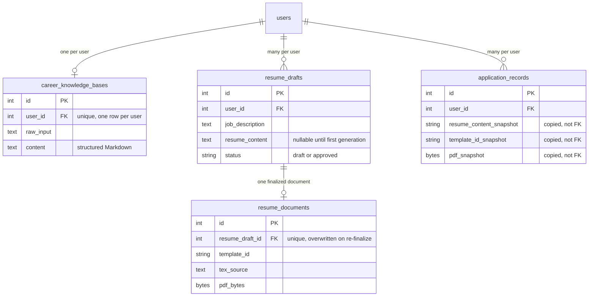

# ManifestCV's Own Tables

mystic-auth's own schema (`users`, PBAC policies/policy history, both audit log tables) is documented in [Database Design](../../mystic_auth/database/design.md). Inherited unmodified, not duplicated here. This doc covers only the four tables ManifestCV's own product code owns.

| Table | Purpose | Doc |
|---|---|---|
| `career_knowledge_bases` | One row per user. Their structured career knowledge base | [Career Knowledge](../career-knowledge/overview.md) |
| `resume_drafts` | Many per user. One per tailored resume in progress | [Resumes](../resumes/overview.md) |
| `resume_documents` | One per approved draft. The compiled PDF | [Document Generation](../document-generation/overview.md) |
| `application_records` | Many per user. A self-contained snapshot of each application sent | [Applications](../applications/overview.md) |

`application_records` deliberately has no foreign key back to `resume_drafts`/`resume_documents`: `resume_content_snapshot`/`template_id_snapshot`/`pdf_snapshot` are copied at save time, so a tracked application survives the source draft/document being later edited or deleted. See [Applications](../applications/overview.md) for why.

All four cascade-delete on account deletion (`user_id`/`resume_draft_id` foreign keys, `ondelete="CASCADE"`). Unlike mystic-auth's own audit tables, none of ManifestCV's product data is designed to outlive its owning account (the one deliberate exception, `application_records`, still cascades on account deletion. It only survives its *resume draft* being edited or deleted, not the user being deleted).

---

## Migrations

ManifestCV's own four migrations (`c1d2e3f4a5b6` through `f5a6b7c8d9e0`) chain directly after mystic-auth's own migration history rather than branching from it, so a fresh `alembic upgrade head` applies both in one pass. See [Database Design: Migrations](../../mystic_auth/database/design.md#migrations) for the general Alembic workflow this follows.
